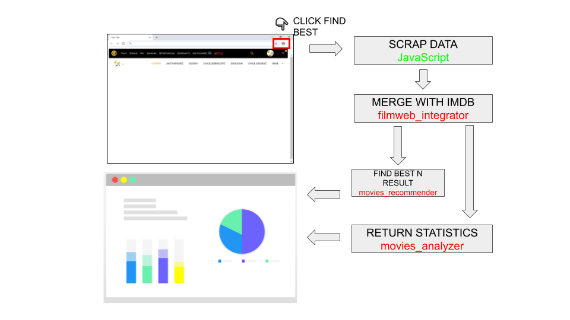
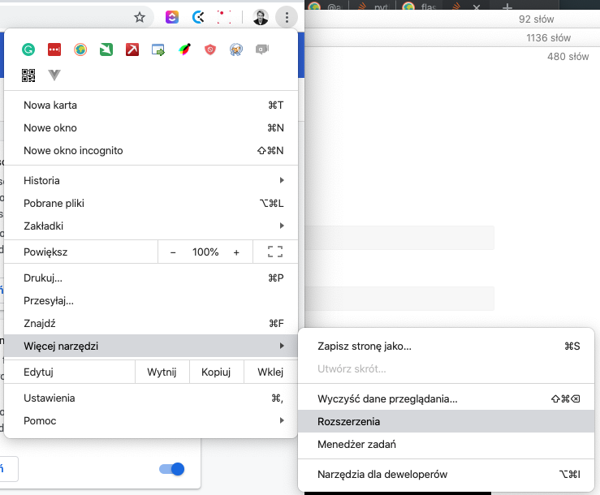
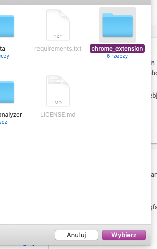
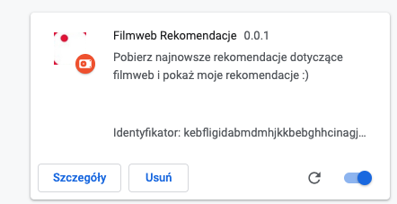
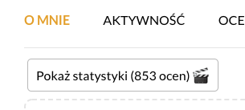
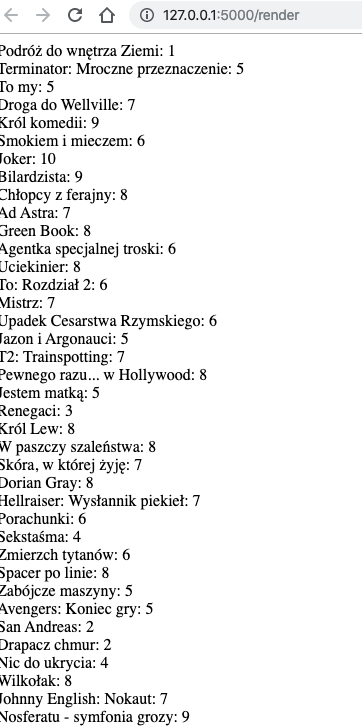

# filmweb-rekomendacje

[](https://travis-ci.org/alexiej/filmweb-rekomendacje)

Projekt ma za zadanie wytworzenie analizatora danych zescrapowanych ze strony filmweb. 

* Stworzenie rozszerzenia do Google Chrome które scrapowałoby dane z filmwebu i pobierało informacje o ulubionych filmach, łączyło dane z. bazą imdb,  przeliczało przy pomocy systemu rekomendacji najlepsze filmy i pokazywało je użytkownikowi razem za analizą i wykresami.



## Zespół:

- **Mateusz** (https://github.com/mateuszrusin/)
- **Krzysiek** (https://github.com/krzysztofho )
- **Arek** (https://github.com/alexiej)

## STRUKTURA PROJEKTU

* `chrome_extension` - Rozszerzenie do Chrome
* `filmweb_integrator` - paczka do łączenia danych z filmweb
* `movies_analyzer` - analiza filmów ściągniętych z filmweb
* `movies_recommender` - paczka do rekomendacji filmwów
* `server` - serwer Flask
* `tests` - zbiór testów do aplikacji


### URUCHAMIANIE:

1. Ściągnięcie wszystkich danych do katalogu `dane`

```python
python setup.py
```

2. Instalacja wymagań

```
pip install -r requirements.txt
```

3. Uruchomienie serwera flask

```
python server.py
```


Sprawdż czy w `chrome_extension/js/content.js`  , `SERVER_URL` wskazuje na ten sam adres :

```javascript
var URL_SERVER = "http://127.0.0.1:5000/render"
```

### CHROME Extension

1. Dodanie rozszerzenia do chrome:



2. Zaznaczenie Tryb developera


3. Załaduj rozpakowane:


4. Wybieramy Chrome Extension



5. Pobrany chrome Extension



### Przejście do strony filmweb o sobie


1. Klikamy `Statystyki filmweb-rekomendacje`

2. Klikamy `Pokaż statystyki` jeśli nie pojawi się w nowym oknie:

   




## Dane

### FWAPI

* Zeskrapowane dane przy pomocy biblioteki: `fwapi `(https://github.com/mateuszrusin/ml-filmweb-score/tree/master/fwapi)

| Kolumna          | Typ   | Opis                                          |
| ---------------- | ----- | --------------------------------------------- |
| ID               | int   | Identyfikator                                 |
| Tytuł Polski     | tekst | Polski tytuł                                  |
| Tytuł Oryginalny | tekst | Oryginalny tytuł                              |
| Rok produkcji    | int   | Rok produkcji                                 |
| Ulubione         | int   | Czy film dodany do Ulubionych?                |
| Ocena            | int   | Ocena na filmwebie, dla danego filmu `[1-10]` |
| Komendarz        | tekst | komentarz do oceny filmu                      |
| Kraj produkcji   | tekst | Kraj produkcji. filmu                         |
| Gatunek          | tekst | lista gatunków podpiętych do filmu            |
| Data             | data  | Data ocenienia filmu                          |

### IMDB Dataset

* Dataset ze strony IMDB https://www.imdb.com/interfaces/

| Kolumna         | Typ     | Opis                                                         |
| --------------- | ------- | ------------------------------------------------------------ |
| tconst          | tekst   | id filmu z IMDB                                              |
| titleType       | tekst   | typ filmu [`tvEpisode`, `short`,`movie`]                     |
| Primary Title   | tekst   | tytuł najbardziej popularny                                  |
| Original Title  | tekst   | tytuł oryginalny                                             |
| isAdult         | binarny | czy dla dorosłych? (`0/1`)                                   |
| startYear       | Int     | Początek roku wydania filmu                                  |
| endYear         | Int     | Koniec roku wyświetlania dla seriali                         |
| runtimeMinutest | int     | Ile minut trwa film                                          |
| genres          | tekst   | gatunek filmu oddzielony przecinkami przykład: `Animation,Comedy,Family` |


### MOVIELENS

- Rekomendacje MovieLens i połączenie z użytkownikami: https://grouplens.org/datasets/movielens/100k/

`u.item`

| Kolumna      | Typ   | Opis                                                         |
| ------------ | ----- | ------------------------------------------------------------ |
| movie id     | int   | Wewnętrzne id filmu                                          |
| movie title  | tekst | Tytuł filmu                                                  |
| release date | data  | data wyjścia filmu                                           |
| imdb link    | link  | link do strony imdb                                          |
| typ          | lista | binarna lista gatunku filmu, każda kolumna ma wartość 1 jeśli należy do danego gatunku  `[unknown , Action , Adventure , Animation ,  Children's , Comedy , Crime , Documentary , Drama , Fantasy , Film-Noir , Horror , Musical , Mystery , Romance , Sci-Fi , Thriller , War , Western ]` |

`u.user` 

Informacje o każdym ożytkowniku który oceniał film

| Kolumna    | Typ   | Opis                                              |
| ---------- | ----- | ------------------------------------------------- |
| user id    | int   | Id użytkownika                                    |
| age        | int   | wiek                                              |
| gender     | tekst | `M`-  male, `F` - female                          |
| occupation | tekst | Czym się zajuje (`writer`, `librarian`, `writer`) |

`u.data`

Informacje o ocenach każdego użytkownika

| Kolumna   | Typ       | Opis                                                       |
| --------- | --------- | ---------------------------------------------------------- |
| user id   | int       | Id użytkownika                                             |
| item id   | int       | id filmu                                                   |
| rating    | int       | Ocena `[1-5]`                                              |
| timestamp | timestamp | Czas w postaci Unix, ilość sekund od czasu: `1/1/1970 UTC` |

## Data Science

* Wykonanie metodami rekomendacji i znalezienie najbardziej pasującego filmu do już ocenionymi. Skorzystanie z biblioteki `surprise` i algorytmu SVD , http://surpriselib.com/.
* Porównanie z innymi algorytmami systemów rekomendacji.
* `Data Engineering` - wyciąganie informacji ze scrapowannej strony i połączenie danych z różnych źródeł takich jak imdb.

## Linki

* http://surpriselib.com/ - bilbioteka surprsie do rekomendacji 
* https://www.udemy.com/course/building-recommender-systems-with-machine-learning-and-ai/ - płatny i dość drogi kurs (549zł), dotyczących budowania systemów rekomendacji. Na stronie. O'Reily (https://learning.oreilly.com/home/) jest dostępny za darmo na okres 10 dni.
